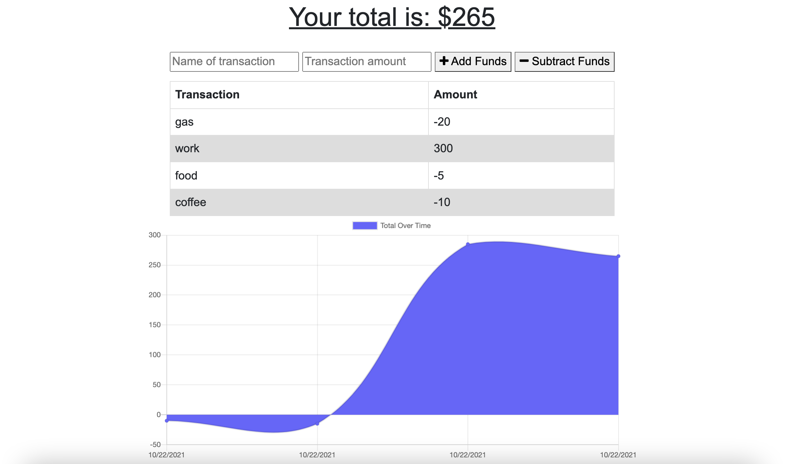

# Budget-Tracker

A progressive web application to keep track of a budget both online and offline. A user can balance their budget by adding entries to the tracker. If the user happens to be offline while adding entries, the entries are stored within a database and then added once the user is back online.

## Table of Contents

- [User Story](#userstory)
- [Screenshots](#screenshots)
- [Technology](#technology)
- [Installation](#installation)
- [Usage](#usage)
- [License](#license)
- [Contributors](#contributors)
- [Questions](#questions)

## User Story

```md
AS AN avid traveller I WANT to be able to track my withdrawals
and deposits with or without a data/internet connection
SO THAT my account balance is accurate when I am traveling
```

## Screenshots



## Technology

- Node.js
- NPM
- Express
- JavaScript
- MongoDB
- Mongoose
- Heroku
- Service-worker
- Manifest

## Installation

Run `npm install` to install application dependencies (express, mongoose).

## Usage

This app is deployed on Heroku [here](https://vb-budget-tracker.herokuapp.com/).

To run locally on CML, run `npm start`. Once the server is started,the app can open at localhost:3001 in a browser of choice.

## Contributors

:woman_with_headscarf: [Valbona Bajrami](https://github.com/valbona1992)

## License

License is [MIT](https://opensource.org/licenses/MIT) standard license.

## Questions

GitHub: https://github.com/valbona1992 <br/>
Email me with any questions: valbona12@gmail.com
